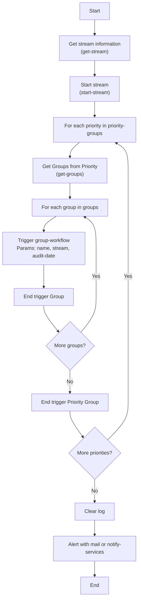

# Version 1

A Data Framework Version 1. This concept use workflow to pass running date on all
process that config in its stream.

```text
core
 ╰─ stream
     ╰─ group
         ╰─ process
```

!!! note

    The audit date control by the steam layer and passing thai audit date to all
    its process after prepare with its frequency.


## Concept


