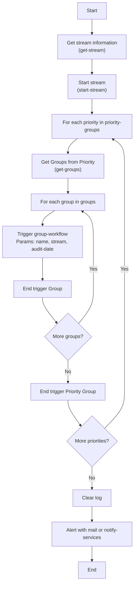

# Version 1

A Data Framework version 1. This concept use pipeline to pass running date on all
node processes.

```text
core
 ╰─ stream
     ╰─ group
         ╰─ process
```

## Stream


```mermaid
flowchart TD
    start[Start] --> getStreamInfo["Get stream information\n(get-stream)"]
    getStreamInfo --> startStream["Start stream\n(start-stream)"]
    startStream --> priorityLoop["For each priority in priority-groups"]

    priorityLoop --> getGroups["Get Groups from Priority\n(get-groups)"]
    getGroups --> groupLoop["For each group in groups"]

    groupLoop --> triggerGroupWorkflow["Trigger group-workflow\nParams: name, stream, audit-date"]
    triggerGroupWorkflow --> endTriggerGroup["End trigger Group"]
    endTriggerGroup --> groupLoopCheck{"More groups?"}

    groupLoopCheck -- Yes --> groupLoop
    groupLoopCheck -- No --> endTriggerPriorityGroup["End trigger Priority Group"]

    endTriggerPriorityGroup --> priorityLoopCheck{"More priorities?"}
    priorityLoopCheck -- Yes --> priorityLoop
    priorityLoopCheck -- No --> clearLog["Clear log"]

    clearLog --> alert["Alert with mail or notify-services"]
    alert --> finish[End]
```
